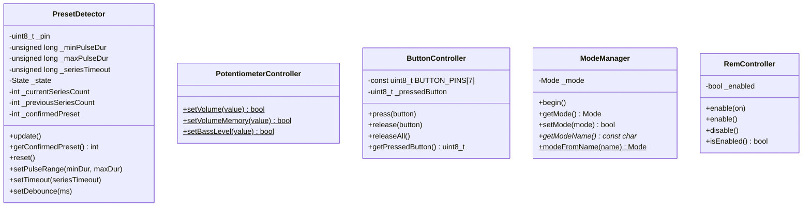

# Volume Adapter

Аппаратный I2C/USART-мост для управления аудиосистемой на базе Arduino Nano (ATmega328P). Принимает JSON-команды через Serial, управляет цифровыми потенциометрами MCP4561 по I2C, эмулирует нажатия кнопок магнитолы через GPIO и детектирует смену пресетов по импульсам оптопары.

---

## Аппаратная конфигурация

| Пин Arduino | Режим | Назначение | Подключение |
|-------------|-------|------------|-------------|
| **A3** | `INPUT_PULLUP` (цифровой) | Вход с оптопары | Оптопара (замыкает на LOW при активном импульсе) |
| **A2** | `OUTPUT` (цифровой) | REM-выход | Управление включением усилителя (HIGH = вкл, LOW = выкл) |
| **A4** (SDA) | I2C | Линия данных I2C | MCP4561 (Volume: `0x2F`, Bass: `0x2E`) |
| **A5** (SCL) | I2C | Линия тактирования I2C | MCP4561 |
| **D3** | `OUTPUT` | Эмуляция кнопки 7 | Кнопка магнитолы |
| **D4** | `OUTPUT` | Эмуляция кнопки 6 | Кнопка магнитолы |
| **D5** | `OUTPUT` | Эмуляция кнопки 5 | Кнопка магнитолы |
| **D6** | `OUTPUT` | Эмуляция кнопки 4 | Кнопка магнитолы |
| **D7** | `OUTPUT` | Эмуляция кнопки 3 | Кнопка магнитолы |
| **D8** | `OUTPUT` | Эмуляция кнопки 2 | Кнопка магнитолы |
| **D10** | `OUTPUT` | Эмуляция кнопки 1 | Кнопка магнитолы |
| **D9** | `OUTPUT` | BUTTON_PIN | Эмуляция нажатия кнопки смены пресета (импульс 500 мс) |

> **Примечание:** пины A2 и A3 используются как цифровые входы/выходы, а не как аналоговые.

---

## Архитектура ПО

Проект состоит из пяти классов и точки входа `main.cpp`.

### Диаграмма классов



> **Техническое замечание:** в `PotentiometerController.h` переменные `currentVolume` и `currentBass` объявлены как `extern`, но в `.cpp` определены со спецификатором `static`, что даёт им внутреннее связывание и блокирует `extern`. Поскольку `main.cpp` не обращается к этим переменным напрямую, ошибка линковки не возникает, но это нарушение ODR.

### PotentiometerController

Управление двумя цифровыми потенциометрами MCP4561 по протоколу I2C через библиотеку `Wire.h`.

| Параметр | Volume | Bass |
|----------|--------|------|
| I2C-адрес | `0x2F` | `0x2E` |
| Команда RAM | `0x00` (WIPER0) | `0x00` (WIPER0) |
| Команда NV | `0x20` (NV_WIPER0) | `0x20` (NV_WIPER0) |
| Диапазон значений | 0–255 | 0–255 |

**Публичные функции:**

| Функция | Режим записи | Поведение |
|---------|-------------|-----------|
| `setVolume(value)` | RAM | Значение сбрасывается при выключении питания |
| `setVolumeMemory(value)` | RAM + NV | Значение сохраняется после выключения питания |
| `setBassLevel(value)` | RAM + NV | Значение сохраняется после выключения питания |

Функции `getVolume()` и `getBassLevel()` определены в `.cpp`, но не объявлены в `.h` — они являются приватными хелперами модуля.

### PresetDetector

Детектирование смены пресетов по импульсам с оптопары. Реализован как конечный автомат с двумя состояниями:

- **IDLE** — ожидание начала серии импульсов
- **IN_SERIES** — приём серии импульсов

**Алгоритм обработки импульса:**

1. Считывание пина A3 через `digitalRead()` с подтяжкой `INPUT_PULLUP`
2. Антидребезг: 5 мс
3. Валидация длительности импульса: 100–200 мкс
4. Если импульс валиден — увеличивается счётчик текущей серии
5. Если импульс невалиден — сброс серии в IDLE

**Завершение серии** (таймаут 400 мс после последнего импульса):

- Если число импульсов вне диапазона 1–10 — серия отбрасывается
- Если две подряд серии дали одинаковое количество импульсов — пресет считается **подтверждённым** (двойное подтверждение)
- Если серии не совпали — первая сохраняется для сравнения со следующей

**Параметры по умолчанию:**

| Параметр | Значение |
|----------|----------|
| Мин. длительность импульса | 100 мкс |
| Макс. длительность импульса | 200 мкс |
| Таймаут серии | 400 мс |
| Антидребезг | 5 мс |

### ButtonController

Эмуляция 7 кнопок магнитолы через GPIO-выходы. Одновременно может быть «нажата» только одна кнопка — при вызове `press()` для другой кнопки текущая автоматически отпускается.

| Номер кнопки | Пин Arduino |
|-------------|-------------|
| 1 | D10 |
| 2 | D8 |
| 3 | D7 |
| 4 | D6 |
| 5 | D5 |
| 6 | D4 |
| 7 | D3 |

### ModeManager

Хранение и переключение режимов работы в EEPROM.

| Режим | Значение | Описание |
|-------|----------|----------|
| `STANDARD` | `0` | Обычный режим |
| `START_MIN_VALUE` | `1` | При старте громкость устанавливается в 1 |

**Структура EEPROM:**

| Адрес | Содержимое |
|-------|------------|
| 0 | Магическое число `0xA5` (признак инициализации) |
| 1 | Текущий режим (`0` или `1`) |

При первом запуске (если по адресу 0 не `0xA5`) записывается магическое число и режим по умолчанию (`STANDARD`).

### RemController

Управление REM-выходом усилителя через пин A2.

| Метод | Действие |
|-------|----------|
| `enable(bool on)` | Включить (`HIGH`) или выключить (`LOW`) REM |
| `enable()` | Включить REM |
| `disable()` | Выключить REM |
| `isEnabled()` | Возвращает текущее состояние |

---

## JUDI-протокол

Формат сообщений: `[JSON]\n` — JSON-объект внутри квадратных скобок, завершающийся символом новой строки.

### Команды

#### Управление громкостью и басом

**`set_volume`** — установка громкости (только RAM, сбрасывается при выключении)

```json
→ [{"command":"set_volume","value":128}]
← [{"status":"success","command":"set_volume","volume":128}]
```

**`set_volume_memo`** — установка громкости с сохранением в NV-память

```json
→ [{"command":"set_volume_memo","value":128}]
← [{"status":"success","command":"set_volume_memo","volume":128}]
```

**`set_bass_level`** — установка уровня баса (RAM + NV)

```json
→ [{"command":"set_bass_level","value":100}]
← [{"status":"success","command":"set_bass_level","value":100}]
```

#### Управление режимом

**`set_mode`** — переключение режима (сохраняется в EEPROM)

```json
→ [{"command":"set_mode","value":"start_min_value"}]
← [{"status":"success","command":"set_mode","mode":"start_min_value"}]
```

**`get_mode`** — запрос текущего режима

```json
→ [{"command":"get_mode"}]
← [{"status":"success","command":"get_mode","mode":"standard"}]
```

#### Управление пресетами

**`change_preset`** — эмуляция нажатия кнопки смены пресета (импульс 500 мс на D9)

```json
→ [{"command":"change_preset"}]
← [{"status":"success","command":"change_preset","message":"Button press simulated (500ms)"}]
```

**`get_preset`** — получение последнего подтверждённого пресета (0, если не подтверждён)

```json
→ [{"command":"get_preset"}]
← [{"command":"preset_changed","value":3}]
```

#### Управление REM

**`set_is_enable_rem`** — включение/выключение REM-выхода (A2)

```json
→ [{"command":"set_is_enable_rem","value":true}]
← [{"status":"success","command":"set_is_enable_rem","is_enable_rem":true}]
```

#### Эмуляция кнопок

**`button_down`** — нажатие эмулированной кнопки (1–7)

```json
→ [{"command":"button_down","value":3}]
← [{"status":"success","command":"button_down","value":3}]
```

**`button_up`** — отпускание эмулированной кнопки (1–7)

```json
→ [{"command":"button_up","value":3}]
← [{"status":"success","command":"button_up","value":3}]
```

#### Служебные

**`ping`** — проверка связи

```json
→ [{"command":"ping"}]
← [{"status":"success","command":"pong","device":"Volume_Adapter","volume_range":"0-255","bass_range":"0-255","mode":"standard"}]
```

### Ошибки протокола

Формат ошибки валидации JSON:

```json
[{"status":"error","message":"Invalid JSON","detail":"...описание ошибки парсинга..."}]
```

Формат ошибки валидации значения (с переданным значением):

```json
[{"status":"error","message":"value must be 0-255","received":300}]
[{"status":"error","message":"button value must be 1-7","received":9}]
```

Формат ошибки неизвестной команды:

```json
[{"status":"error","message":"Unknown command","received_command":"some_unknown"}]
```

Формат ошибки неверного формата сообщения:

```json
[{"status":"error","message":"Message must be enclosed in [ ]"}]
```

Формат ошибки отсутствующего поля `command`:

```json
[{"status":"error","message":"Missing or empty 'command' field"}]
```

### Welcome-сообщение

При старте устройство отправляет:

```json
[{"status":"ready","device":"Volume Adapter","protocol":"JUDI","mode":"standard","volume_range":"0-255","bass_range":"0-255"}]
```

---

## Логика работы

### Главный цикл `loop()`

```mermaid
flowchart TD
    A[loop] --> B{Таймер BUTTON_PIN истёк?}
    B -->|Да, 500 мс| C[Сброс D9 в LOW]
    B -->|Нет| D[PresetDetector.update]
    C --> D
    D --> E{Подтверждённый пресет изменился?}
    E -->|Да| F[Обновить lastConfirmedPreset]
    E -->|Нет| G{Serial: есть данные?}
    F --> G
    G -->|Нет| A
    G -->|Да| H[Чтение строки до \\n]
    H --> I{Строка в \[...\]?}
    I -->|Нет| J[Ошибка: неверный формат]
    I -->|Да| K[parseCommand]
    K --> L{Команда распознана?}
    L -->|Да| M[Выполнить команду, отправить ответ]
    L -->|Нет| N[Ошибка: неизвестная команда]
    J --> A
    M --> A
    N --> A
```

### Порядок инициализации `setup()`

1. `Serial.begin(115200)` — инициализация USART
2. `Wire.begin()` — инициализация I2C
3. Настройка D9 как OUTPUT (LOW)
4. Задержка 100 мс
5. Отправка welcome-сообщения
6. Задержка 100 мс
7. Инициализация `ModeManager` (чтение EEPROM)
8. Инициализация `ButtonController` (все пины в LOW)
9. Инициализация `RemController` (REM в LOW)
10. Если режим `START_MIN_VALUE` — установка громкости в 1

---

## Сборка и прошивка

Проект собирается с помощью [PlatformIO](https://platformio.org/).

### Конфигурация (`platformio.ini`)

| Параметр | Значение |
|----------|----------|
| Платформа | `atmelavr` |
| Плата | `nanoatmega328new` |
| Фреймворк | `arduino` |
| Скорость монитора | 115200 |
| Зависимость | `bblanchon/ArduinoJson@^7.2.2` |
| Build flags | `-Wno-deprecated-declarations` |

### Команды

```bash
# Сборка проекта
pio run

# Сборка и прошивка
pio run --target upload

# Монитор последовательного порта
pio device monitor
```

### Структура проекта

```
.
├── platformio.ini
├── README.md
├── rules.md
└── src/
    ├── main.cpp
    ├── PotentiometerController.h
    ├── PotentiometerController.cpp
    ├── PresetDetector.h
    ├── PresetDetector.cpp
    ├── ButtonController.h
    ├── ButtonController.cpp
    ├── ModeManager.h
    ├── ModeManager.cpp
    ├── RemController.h
    └── RemController.cpp
```

---

## Правила стиля (`rules.md`)

Кодовая база следует двум принципам:
- **Язык:** документация и комментарии на русском
- **Архитектура:** SOLID (разделение на классы с единой ответственностью)
