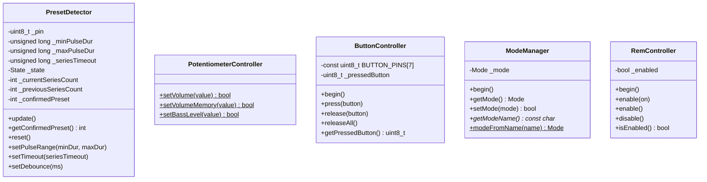

# Архитектура ПО

Проект построен по принципам SOLID: пять классов с единой ответственностью и точка входа `main.cpp`.

---

## Диаграмма классов



---

## PotentiometerController

Управление двумя цифровыми потенциометрами MCP4561 по протоколу I2C через `Wire.h`. Реализован как набор свободных функций (не класс).

### Параметры потенциометров

| Параметр | Volume | Bass |
|---|---|---|
| I2C-адрес | `0x2F` | `0x2E` |
| Команда RAM | `0x00` (WRITE_WIPER0) | `0x00` (WRITE_WIPER0) |
| Команда NV | `0x20` (WRITE_NV_WIPER0) | `0x20` (WRITE_NV_WIPER0) |
| Диапазон значений | 0–255 | 0–255 |

### Публичные функции

| Функция | Режим записи | Поведение |
|---|---|---|
| `setVolume(value)` | RAM | Значение сбрасывается при выключении питания |
| `setVolumeMemory(value)` | RAM + NV | Значение сохраняется после выключения питания |
| `setBassLevel(value)` | RAM + NV | Значение сохраняется после выключения питания |

Все три функции возвращают `bool`: `true` при успешной передаче по I2C, `false` при ошибке (NACK от устройства).

---

## PresetDetector

Детектирование смены пресетов по импульсам оптопары на пине A3. Реализован как конечный автомат с двумя состояниями:

- **IDLE** — ожидание начала серии импульсов
- **IN_SERIES** — приём серии импульсов

### Алгоритм обработки импульса

1. Чтение пина A3 через `digitalRead()` (режим `INPUT_PULLUP`)
2. Антидребезг: уровень должен быть стабилен 5 мс
3. Валидация длительности импульса: 100–200 мкс
4. Если импульс валиден — увеличение счётчика текущей серии
5. Если импульс невалиден — сброс серии в IDLE

### Завершение серии (таймаут 400 мс после последнего импульса)

- Если число импульсов вне диапазона 1–10 — серия отбрасывается
- Если две подряд серии дали одинаковое количество импульсов — пресет **подтверждён** (двойное подтверждение)
- Если серии не совпали — первая сохраняется для сравнения со следующей

### Параметры по умолчанию

| Параметр | Значение |
|---|---|
| `_minPulseDur` | 100 мкс |
| `_maxPulseDur` | 200 мкс |
| `_seriesTimeout` | 400 мс |
| `_debounceTime` | 5 мс |

---

## ButtonController

Эмуляция 7 кнопок через GPIO-выходы. Одновременно может быть «нажата» только одна кнопка — при вызове `press()` для другой кнопки текущая автоматически отпускается.

### Соответствие кнопок и пинов

| Номер кнопки | Пин Arduino |
|---|---|
| 1 | D10 |
| 2 | D8 |
| 3 | D7 |
| 4 | D6 |
| 5 | D5 |
| 6 | D4 |
| 7 | D3 |

> Пин D9 (`BUTTON_PIN`) **не входит** в массив `BUTTON_PINS` и управляется отдельно в `main.cpp` — см. раздел «Главный цикл».

---

## ModeManager

Хранение и переключение режимов работы в EEPROM.

| Режим | Значение | Описание |
|---|---|---|
| `STANDARD` | `0` | Обычный режим |
| `START_MIN_VALUE` | `1` | При старте громкость устанавливается в 1 |

### Структура EEPROM

| Адрес | Содержимое |
|---|---|
| 0 | Магическое число `0xA5` (признак инициализации) |
| 1 | Текущий режим (`0` или `1`) |

При первом запуске (если по адресу 0 не `0xA5`) записывается магическое число и режим `STANDARD`.

---

## RemController

Управление REM-выходом усилителя через пин A2.

| Метод | Действие |
|---|---|
| `enable(bool on)` | `HIGH` или `LOW` на A2 |
| `enable()` | `HIGH` на A2 (REM вкл) |
| `disable()` | `LOW` на A2 (REM выкл) |
| `isEnabled()` | Возвращает `true`/`false` |

---

## Взаимодействие модулей

```
main.cpp
  ├── PresetDetector   (A3)  — опрос на каждой итерации loop()
  ├── PotentiometerController  — свободные функции I2C
  ├── ButtonController (D3..D10) — эмуляция кнопок
  ├── ModeManager      (EEPROM) — режим START_MIN_VALUE / STANDARD
  └── RemController    (A2)  — REM-выход
```

`main.cpp` выполняет роль координатора: парсит JSON-команды из Serial, вызывает соответствующие функции модулей и формирует JSON-ответы.

---

## Главный цикл `loop()`

```mermaid
flowchart TD
    A[loop] --> B{Таймер BUTTON_PIN истёк?}
    B -->|Да, 500 мс| C[Сброс D9 в LOW]
    B -->|Нет| D[PresetDetector.update]
    C --> D
    D --> E{Подтверждённый пресет изменился?}
    E -->|Да| F[Обновить lastConfirmedPreset]
    E -->|Нет| G{Serial: есть данные?}
    F --> G
    G -->|Нет| A
    G -->|Да| H[Чтение строки до \n]
    H --> I{Строка в \[...\]?}
    I -->|Нет| J[Ошибка: неверный формат]
    I -->|Да| K[parseCommand]
    K --> L{Команда распознана?}
    L -->|Да| M[Выполнить команду, отправить ответ]
    L -->|Нет| N[Ошибка: неизвестная команда]
    J --> A
    M --> A
    N --> A
```

## Порядок инициализации `setup()`

1. `Serial.begin(115200)` — USART
2. `Wire.begin()` — I2C
3. `pinMode(BUTTON_PIN, OUTPUT); digitalWrite(BUTTON_PIN, LOW)` — D9 в LOW
4. `delay(100)` — стабилизация
5. **Отправка welcome-сообщения** (до инициализации модулей — см. ниже)
6. `delay(100)`
7. `ModeManager::begin()` — чтение EEPROM
8. `ButtonController::begin()` — все пины кнопок в OUTPUT/LOW
9. `RemController::begin()` — A2 в OUTPUT/LOW
10. Если режим `START_MIN_VALUE` — `setVolume(1)` (RAM)

> **Особенность:** welcome-сообщение отправляется **до** инициализации режима из EEPROM. Поле `mode` в нём всегда содержит значение по умолчанию (`"standard"`), т.к. `ModeManager::begin()` ещё не вызван.

---

## Известные проблемы (Known Issues)

### 1. Нарушение ODR в PotentiometerController

**Файлы:** `src/PotentiometerController.h:24-25`, `src/PotentiometerController.cpp:4-5`

```cpp
// .h — объявление с extern
extern int currentVolume;
extern int currentBass;

// .cpp — определение со static (внутреннее связывание)
static int currentVolume = -1;
static int currentBass = -1;
```

Спецификатор `static` в `.cpp` даёт переменным внутреннее связывание (internal linkage), что блокирует `extern` из заголовочного файла. Поскольку `main.cpp` обращается к этим переменным через `extern`-объявление, линкер должен был бы выдать ошибку «undefined reference». Однако на практике компилятор AVR-GCC, по-видимому, разрешает символы иначе, либо линкер находит определение в той же единице трансляции — ошибка не проявляется, но это **нарушение ODR (One Definition Rule)**.

**Влияние:** `main.cpp` читает `currentVolume` и `currentBass` в обработчике `ping` (`main.cpp:219,221`). Если линковка сломается при смене версии компилятора, `ping` будет возвращать неинициализированные значения.

**Рекомендация:** убрать `static` из определений в `.cpp`, оставив `extern` в `.h`.

### 2. Welcome-сообщение до инициализации ModeManager

`ModeManager::getModeName()` вызывается в welcome-сообщении до вызова `ModeManager::begin()`, поэтому поле `mode` всегда `"standard"` независимо от сохранённого в EEPROM режима (`main.cpp:248`).

### 3. Возможный конфликт назначения пина D9

По данным нетлиста, пин D9 (U77-12) подключён к оптопаре U33 (ключ `ACC_3.3V_K`). Код использует этот же пин как `BUTTON_PIN` для импульса смены пресета (500 мс HIGH). В зависимости от ревизии платы и положения джамперов эти две функции могут конфликтовать. Необходимо уточнить соответствие версий схемы и прошивки.

### 4. Расхождение пинов кнопок между нетлистом и кодом

По данным нетлиста пины Arduino, подключённые к H1: **U77-{13,11,10,9,8,7,6}** (соотв. H1-1..H1-7). Код `ButtonController.cpp:5` использует массив пинов **{10,8,7,6,5,4,3}**. Это указывает на разные ревизии платы. При переносе прошивки на плату, соответствующую нетлисту, необходимо скорректировать массив `BUTTON_PINS`.

---

## Принципы SOLID

Проект следует принципам SOLID (требование `rules.md`):

| Принцип | Применение |
|---|---|
| **S** — Single Responsibility | Каждый класс отвечает ровно за одну задачу: детекция пресетов, I2C-потенциометры, кнопки, режим EEPROM, REM-выход |
| **O** — Open/Closed | Классы расширяются через параметры (`setPulseRange`, `setTimeout`, `setDebounce`) без модификации исходного кода |
| **L** — Liskov Substitution | Наследование не используется |
| **I** — Interface Segregation | Публичные интерфейсы классов минимальны — только нужные клиенту методы |
| **D** — Dependency Inversion | `main.cpp` зависит от заголовочных файлов модулей, а не наоборот |
