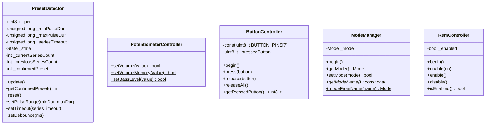

# Архитектура ПО

Проект построен по принципам SOLID: четыре класса и один модуль свободных функций с единой ответственностью, а также точка входа `main.cpp`.

---

## Диаграмма классов



---

## PotentiometerController

Управление двумя цифровыми потенциометрами MCP4561 по протоколу I2C через `Wire.h`. Реализован как набор свободных функций (не класс).

### Параметры потенциометров

| Параметр | Volume | Bass |
|---|---|---|
| I2C-адрес | `0x2F` | `0x2E` |
| Команда RAM | `0x00` (WRITE_WIPER0) | `0x00` (WRITE_WIPER0) |
| Команда NV | `0x20` (WRITE_NV_WIPER0) | `0x20` (WRITE_NV_WIPER0) |
| Диапазон значений | 0–255 | 0–255 |

### Публичные функции

| Функция | Режим записи | Поведение |
|---|---|---|
| `setVolume(value)` | RAM | Значение сбрасывается при выключении питания |
| `setVolumeMemory(value)` | RAM + NV | Значение сохраняется после выключения питания |
| `setBassLevel(value)` | RAM + NV | Значение сохраняется после выключения питания |

Все три функции возвращают `bool`: `true` при успешной передаче по I2C, `false` при ошибке (NACK от устройства).

---

## PresetDetector

Детектирование смены пресетов по импульсам оптопары на пине A3. Реализован как конечный автомат с двумя состояниями:

- **IDLE** — ожидание начала серии импульсов
- **IN_SERIES** — приём серии импульсов

### Алгоритм обработки импульса

1. Чтение пина A3 через `digitalRead()` (режим `INPUT_PULLUP`)
2. Антидребезг: уровень должен быть стабилен 5 мс
3. Валидация длительности импульса: 100–200 мкс
4. Если импульс валиден — увеличение счётчика текущей серии
5. Если импульс невалиден — сброс серии в IDLE

### Завершение серии (таймаут 400 мс после последнего импульса)

- Если число импульсов вне диапазона 1–10 — серия отбрасывается
- Если две подряд серии дали одинаковое количество импульсов — пресет **подтверждён** (двойное подтверждение)
- Если серии не совпали — первая сохраняется для сравнения со следующей

### Параметры по умолчанию

| Параметр | Значение |
|---|---|
| `_minPulseDur` | 100 мкс |
| `_maxPulseDur` | 200 мкс |
| `_seriesTimeout` | 400 мс |
| `_debounceTime` | 5 мс |

---

## ButtonController

Эмуляция 7 кнопок через GPIO-выходы. Одновременно может быть «нажата» только одна кнопка — при вызове `press()` для другой кнопки текущая автоматически отпускается.

### Соответствие кнопок и пинов

| Номер кнопки | Пин Arduino |
|---|---|
| 1 | D10 |
| 2 | D8 |
| 3 | D7 |
| 4 | D6 |
| 5 | D5 |
| 6 | D4 |
| 7 | D3 |

> Пин D9 **не входит** в массив `BUTTON_PINS` и управляется отдельно в `main.cpp`. Это штатное архитектурное решение: D9 работает через оптопару U33 с гальванической развязкой (логический уровень +3.3V на CN1-4), тогда как ButtonController использует прямые GPIO-выходы (5V, без развязки) на разъём H1. Подробнее — см. раздел «PresetControl».

---

## ModeManager

Хранение и переключение режимов работы в EEPROM.

| Режим | Значение | Описание |
|---|---|---|
| `STANDARD` | `0` | Обычный режим |
| `START_MIN_VALUE` | `1` | При старте громкость устанавливается в 1 |

### Структура EEPROM

| Адрес | Содержимое |
|---|---|
| 0 | Магическое число `0xA5` (признак инициализации) |
| 1 | Текущий режим (`0` или `1`) |

При первом запуске (если по адресу 0 не `0xA5`) записывается магическое число и режим `STANDARD`.

---

## RemController

Управление REM-выходом усилителя через пин A2.

| Метод | Действие |
|---|---|
| `enable(bool on)` | `HIGH` или `LOW` на A2 |
| `enable()` | `HIGH` на A2 (REM вкл) |
| `disable()` | `LOW` на A2 (REM выкл) |
| `isEnabled()` | Возвращает `true`/`false` |

---

## PresetControl (D9 + U33 → CN1-4)

Гальванически развязанный цифровой логический выход смены пресета аудиопроцессора. Единственная в системе линия, использующая оптопару для передачи цифрового сигнала на внешнее устройство.

### Схема прохождения сигнала

```
Arduino D9 ──► R88 (470Ω) ──► U33 LED (FOD817BW)
U33 фототранзистор (коллектор) ──► ACC_3.3V_K (+3.3V_Isolated)
U33 фототранзистор (эмиттер)  ──► CN1-4 (цифровой вход внешнего устройства)
```

### Принцип работы

| Состояние D9 | U33 | CN1-4 | Физический смысл |
|---|---|---|---|
| LOW | LED погашен, транзистор закрыт | Высокоимпедансное состояние | Нет команды |
| HIGH (500 мс) | LED горит, транзистор открыт, V<sub>CE(sat)</sub> ≤ 0.3V | Подтянут к +3.3V_Isolated через U33 | Импульс смены пресета |

### Электрические параметры

| Параметр | Значение |
|---|---|
| Прямой ток LED (I<sub>F</sub>) | ≈ 8.1 мА (5V − 1.2V) / 470Ω |
| Напряжение на CN1-4 (HIGH) | +3.3V минус V<sub>CE(sat)</sub> ≤ 0.3V |
| Выходной ток CN1-4 | ≤ 10 мкА (входной ток утечки КМОП-приёмника) |
| Длительность импульса | 500 мс (константа `BUTTON_PRESS_DURATION_MS`) |
| Гальваническая развязка | ≥ 5000 V<sub>RMS</sub> (FOD817BW) |

### Протокольная команда

Команда `change_preset` формирует одиночный импульс HIGH длительностью 500 мс. Ответ возвращается немедленно, до завершения импульса. Автосброс D9 в LOW происходит в следующей итерации `loop()` по таймеру.

### Отличие от ButtonController

| Характеристика | PresetControl (D9) | ButtonController (D3–D8, D10) |
|---|---|---|
| Тип выхода | Цифровой логический сигнал, гальванически развязанный | Прямой GPIO, без развязки |
| Физический уровень | +3.3V (изолированная сторона) | +5V (сторона Arduino) |
| Разъём | CN1-4 | H1 |
| Команда | `change_preset` (импульс) | `button_down`/`button_up` (статический уровень) |
| Гальваническая развязка | Есть (оптопара U33, 5000 V<sub>RMS</sub>) | Нет |

### Архитектурное обоснование (Trade-off)

D9 вынесен из `ButtonController` **осознанно**, а не по ошибке:

1. **Разные физические уровни.** ButtonController работает на прямых GPIO (5V, без развязки). PresetControl — на изолированной стороне через оптопару (3.3V, гальванически развязан). Смешивание в одном классе нарушило бы SRP.
2. **Разная временна́я семантика.** ButtonController управляет статическими уровнями (нажать/держать/отпустить). PresetControl — импульс фиксированной длительности с автоматическим сбросом по таймеру.
3. **Независимость конфигурации.** Параметры оптопары (I<sub>F</sub>, CTR, V<sub>CE(sat)</sub>) и длительность импульса (`BUTTON_PRESS_DURATION_MS`) не имеют отношения к GPIO-эмуляции и не должны быть частью контракта ButtonController.

> **Примечание:** в будущих ревизиях платы при переходе на MCU с бóльшим числом GPIO (ATmega328PB, STM32F0) PresetControl может быть оформлен как самостоятельный класс `PresetOutputController` с инкапсуляцией таймера и параметров оптопары.

---

## Взаимодействие модулей

```
main.cpp
  ├── PresetDetector   (A3)           — опрос на каждой итерации loop()
  ├── PresetControl    (D9 → U33)     — импульс смены пресета (CN1-4, гальванически развязан)
  ├── PotentiometerController         — свободные функции I2C
  ├── ButtonController (D3..D8, D10)  — эмуляция кнопок (H1, без развязки)
  ├── ModeManager      (EEPROM)       — режим START_MIN_VALUE / STANDARD
  └── RemController    (A2)           — REM-выход
```

`main.cpp` выполняет роль координатора: парсит JSON-команды из Serial, вызывает соответствующие функции модулей и формирует JSON-ответы.

---

## Главный цикл `loop()`

```mermaid
flowchart TD
    A[loop] --> B{Таймер D9 истёк?<br/>(импульс смены пресета)}
    B -->|Да, 500 мс| C[Сброс D9 в LOW<br/>U33 закрыт, CN1-4 в Z]
    B -->|Нет| D[PresetDetector.update]
    C --> D
    D --> E{Подтверждённый пресет изменился?}
    E -->|Да| F[Обновить lastConfirmedPreset]
    E -->|Нет| G{Serial: есть данные?}
    F --> G
    G -->|Нет| A
    G -->|Да| H[Чтение строки до \n]
    H --> I{Строка в \[...\]?}
    I -->|Нет| J[Ошибка: неверный формат]
    I -->|Да| K[parseCommand]
    K --> L{Команда распознана?}
    L -->|Да| M[Выполнить команду, отправить ответ]
    L -->|Нет| N[Ошибка: неизвестная команда]
    J --> A
    M --> A
    N --> A
```

## Порядок инициализации `setup()`

1. `Serial.begin(115200)` — USART
2. `Wire.begin()` — I2C
3. `pinMode(BUTTON_PIN, OUTPUT); digitalWrite(BUTTON_PIN, LOW)` — D9 в LOW (U33 LED погашен, CN1-4 в высокоимпедансном состоянии)
4. `delay(100)` — стабилизация
5. **Отправка welcome-сообщения** (до инициализации модулей — см. ниже)
6. `delay(100)`
7. `ModeManager::begin()` — чтение EEPROM
8. `ButtonController::begin()` — все пины кнопок в OUTPUT/LOW
9. `RemController::begin()` — A2 в OUTPUT/LOW
10. Если режим `START_MIN_VALUE` — `setVolume(1)` (RAM)

> **Особенность:** welcome-сообщение отправляется **до** инициализации режима из EEPROM. Поле `mode` в нём всегда содержит значение по умолчанию (`"standard"`), т.к. `ModeManager::begin()` ещё не вызван.

---

## Известные проблемы (Known Issues)

### 1. Нарушение ODR в PotentiometerController

**Файлы:** `src/PotentiometerController.h:24-25`, `src/PotentiometerController.cpp:4-5`

```cpp
// .h — объявление с extern
extern int currentVolume;
extern int currentBass;

// .cpp — определение со static (внутреннее связывание)
static int currentVolume = -1;
static int currentBass = -1;
```

Спецификатор `static` в `.cpp` даёт переменным внутреннее связывание (internal linkage), что блокирует `extern` из заголовочного файла. Поскольку `main.cpp` обращается к этим переменным через `extern`-объявление, линкер должен был бы выдать ошибку «undefined reference». Однако на практике компилятор AVR-GCC, по-видимому, разрешает символы иначе, либо линкер находит определение в той же единице трансляции — ошибка не проявляется, но это **нарушение ODR (One Definition Rule)**.

**Влияние:** `main.cpp` читает `currentVolume` и `currentBass` в обработчике `ping` (`main.cpp:219,221`). Если линковка сломается при смене версии компилятора, `ping` будет возвращать неинициализированные значения.

**Рекомендация:** убрать `static` из определений в `.cpp`, оставив `extern` в `.h`.

### 2. Welcome-сообщение до инициализации ModeManager

`ModeManager::getModeName()` вызывается в welcome-сообщении до вызова `ModeManager::begin()`, поэтому поле `mode` всегда `"standard"` независимо от сохранённого в EEPROM режима (`main.cpp:248`).

### 3. Расхождение пинов кнопок между нетлистом и кодом

По данным нетлиста пины Arduino, подключённые к H1: **U77-{13,11,10,9,8,7,6}** (соотв. H1-1..H1-7). Код `ButtonController.cpp:5` использует массив пинов **{10,8,7,6,5,4,3}**. Это указывает на разные ревизии платы. При переносе прошивки на плату, соответствующую нетлисту, необходимо скорректировать массив `BUTTON_PINS`.

---

## Принципы SOLID

Проект следует принципам SOLID (требование `rules.md`):

| Принцип | Применение |
|---|---|
| **S** — Single Responsibility | Каждый класс отвечает ровно за одну задачу: детекция пресетов, I2C-потенциометры, кнопки, режим EEPROM, REM-выход |
| **O** — Open/Closed | Классы расширяются через параметры (`setPulseRange`, `setTimeout`, `setDebounce`) без модификации исходного кода |
| **L** — Liskov Substitution | Наследование не используется |
| **I** — Interface Segregation | Публичные интерфейсы классов минимальны — только нужные клиенту методы |
| **D** — Dependency Inversion | `main.cpp` зависит от заголовочных файлов модулей, а не наоборот |

---

## Анализ аппаратных компромиссов (Trade-off Analysis)

### T-01. ATmega328P vs STM32F0

| Критерий | ATmega328P (выбрано) | STM32F030K6T6 | Оценка |
|---|---|---|---|
| Тактовая частота | 16 МГц | 48 МГц (Cortex-M0) | STM32 избыточен для задачи (UART 115200 + I2C 100 кГц — 5% загрузки AVR) |
| Периферия | 1×UART, 1×I2C, 14×GPIO | 2×UART, 2×I2C, 26×GPIO | Достаточно обоих |
| Питание | 5V (LDO от 12V) | 3.3V (LDO от 12V) | 5V удобнее для прямого GPIO (V<sub>OH</sub> ≥ 4.2V), согласование с 3.3V через оптопары |
| Цена (100 шт.) | $2.30 | $1.80 | STM32 дешевле на 22% |
| Экосистема | Arduino IDE + PlatformIO, обширное DIY-сообщество | STM32CubeIDE / PlatformIO, крутая кривая входа | AVR проще для open-source сообщества |
| Отладка | UPDI (через программатор) | SWD (стандарт ARM) | STM32 удобнее для разработки |
| Энергопотребление | 12 мА активный | 23 мА активный (48 МГц) | AVR экономичнее на 48% |
| CAN | Нет (нужен внешний MCP2515) | Нет (нужен STM32F042 с CAN) | Паритет |

**Вердикт:** ATmega328P оправдан для v1.x как платформа с минимальным порогом входа для DIY-сообщества. При переходе к v2.0 (CAN, Bluetooth) рекомендован STM32F042K6T6 (Cortex-M0 + CAN + USB-FS, $2.10/100 шт.) как минимально достаточный MCU с CAN-контроллером на кристалле.

### T-02. MCP4561 (цифровой потенциометр) vs ЦАП (MCP4725/PCM5102)

| Критерий | MCP4561 (выбрано) | MCP4725 (I2C ЦАП) | PCM5102 (I2S ЦАП) |
|---|---|---|---|
| Разрядность | 256 шагов (8 бит) | 4096 шагов (12 бит) | 16/24/32 бит |
| Интерфейс | I2C (100 кГц) | I2C (до 3.4 МГц) | I2S (требует DMA + I2S-периферию) |
| Тип выхода | Резистивный (R = 0–5 кОм) | Напряжение (0 – V<sub>DD</sub>) | Аналоговый аудиовыход (line level) |
| Подключение к магнитоле | В разрыв аналогового тракта (пассивный элемент) | Требует инжекции напряжения в аудиотракт | Полная замена аудиотракта (другая архитектура) |
| NV-память | Есть (WRITE_NV_WIPER0) | Нет | Нет |
| Цена | $1.20 | $1.50 | $3.80 |

**Вердикт:** MCP4561 — оптимальный выбор для задачи «врезаться в существующий аналоговый тракт без изменения схемы магнитолы». ЦАП потребовал бы разрыва аудиотракта на уровне линейного сигнала и добавления усилителя — кратно сложнее и дороже.

### T-03. Оптопары FOD817BW vs цифровые изоляторы (Si8621, ISO77xx)

| Критерий | FOD817BW (выбрано) | ISO1540DR (I2C) | Si8621 (цифровой) |
|---|---|---|---|
| Тип сигнала | Медленный цифровой/DC | I2C (двунаправленный) | Высокоскоростной цифровой (до 150 Мбит/с) |
| Задержка | 18 мкс (t<sub>on</sub>/t<sub>off</sub>) | 50 нс | 10 нс |
| CTR / надёжность | Деградация CTR со временем (−20% за 10 лет) | Нет деградации (магнитная связь) | Нет деградации (ёмкостная связь) |
| Кол-во каналов | 1 | 2 (SDA + SCL) | 2 |
| Цена | $0.25 | $2.80 | $1.80 |
| Применение | U2, U3, U33 (DC-сигналы: кнопки, REM, пресет) | U111 (двунаправленный I2C) | Не требуется |

**Вердикт:** FOD817BW оправдан для медленных DC-сигналов (пресет, REM, ACC_CTRL). ISO1540DR — безальтернативен для двунаправленного I2C в данной ценовой категории. Деградация CTR оптопар некритична: I<sub>F</sub> = 8 мА при минимальном CTR 50% даёт I<sub>C</sub> ≥ 4 мА — достаточно для насыщения с 3× запасом.

### T-04. UART 115200 vs CAN как внешний интерфейс

| Критерий | UART 115200 (выбрано) | CAN 500 кбит/с | Оценка |
|---|---|---|---|
| Пропускная способность | ~11.5 кБ/с (сырая) | ~45 кБ/с (сырая) | CAN быстрее в 4×, но JSON-команды ≤ 256 байт — UART достаточно |
| Топология | Точка-точка (1 хост) | Шина (до 32 узлов) | CAN лучше для сложных систем |
| Помехозащищённость | Низкая (однопроводный сигнал) | Высокая (дифференциальная пара, CRC, арбитраж) | CAN — для автомобиля, UART — для лаборатории |
| Стек протоколов | Нет (сырой UART) | CAN + CANopen / J1939 | CAN требует стека |
| Сложность реализации | `Serial.readStringUntil('\n')` | Требует драйвер CAN (MCP2515 или встроенный) | UART проще для MVP |
| Дальность | 1–2 м (TTL) | До 40 м (CAN) | CAN лучше для авто |
| Аппаратные затраты | 0 (встроенный UART) | +$2.50 (MCP2515 + MCP2551) | UART дешевле |

**Вердикт:** UART 115200 — правильный выбор для v1.0 (MVP, лабораторный стол). Для автомобильной эксплуатации v2.0 необходим переход на CAN. Текущий протокол JUDI легко адаптируется: формат `[JSON]\n` сохраняется, транспорт меняется с Serial на CAN-фреймы (multipacket transport).
