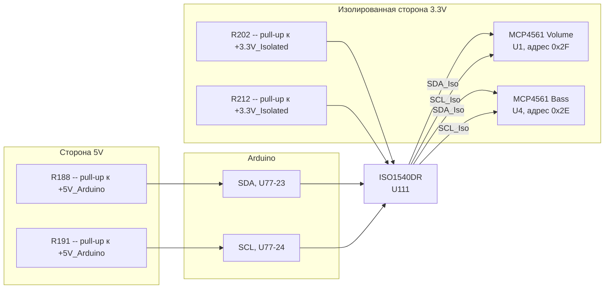
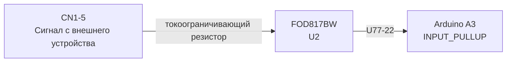
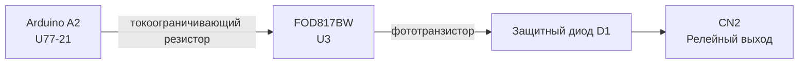
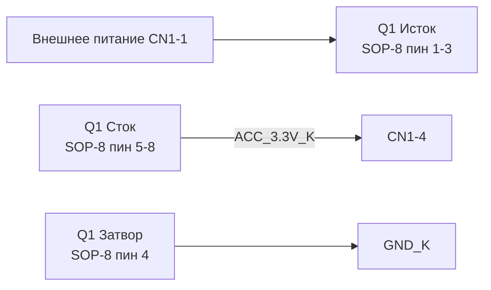
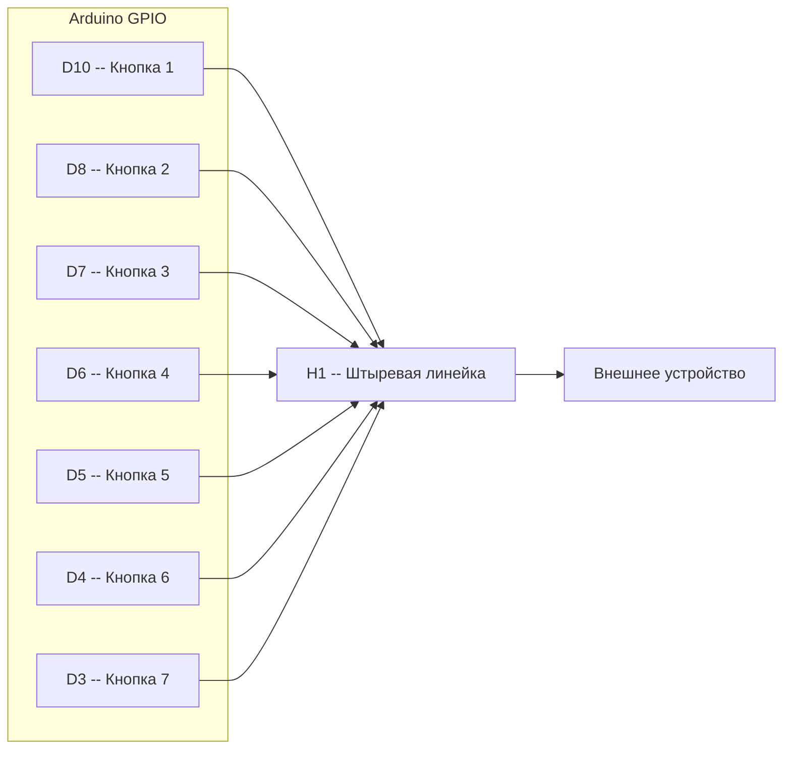

# Аппаратная конфигурация

Плата Volume Adapter на базе Arduino Nano (ATmega328P). Декодирование нетлиста схемы.

---

## Спецификация компонентов (BOM)

| RefDes (нетлист) | Обозначение | Компонент | Корпус | Кол-во | Назначение |
|---|---|---|---|---|---|
| U77 | U77 | Arduino Nano (ATmega328P) | DIP-30 | 1 | Микроконтроллер |
| MCP4561-2E/MS | U1 | MCP4561-502E/MS | PDIP-8 | 1 | Цифровой потенциометр 5 кОм, 256 шагов (Volume, I2C 0x2F) |
| MCP4561-508E/MS | U4 | MCP4561-502E/MS | PDIP-8 | 1 | Цифровой потенциометр 5 кОм (Bass, I2C 0x2E); RefDes «508E» — опечатка в EDA |
| U111 | U5 | ISO1540DR | PDIP-8 | 1 | Двунаправленный изолятор I2C |
| U2, U3, U33 | U2, U3, U33 | FOD817BW | DIP-4 | 3 | Оптопары (транзисторный выход) |
| Q1 | Q1 | HIRF7424TRPBF | SOP-8 | 1 | N-канальный MOSFET (защита/коммутация питания) |
| D1 | D1 | 1N4148WQ-7-F | SOD-123 | 1 | Защитный диод релейного выхода |
| R188, R191 | R188, R191 | 4.7kΩ | 1206 | 2 | Подтяжка I2C, сторона Arduino (+5V_Arduino) |
| R202, R212 | R202, R212 | 4.7kΩ | 1206 | 2 | Подтяжка I2C, изолированная сторона (+3.3V_Isolated) |
| R1 | R1 | 470Ω | 1206 | 1 | Токоограничивающий резистор оптопары U3 (REM) |
| R88 | R88 | 470Ω | 1206 | 1 | Токоограничивающий резистор оптопары U33 (ACC_3.3V) |
| R114 | R114 | 470Ω | 1206 | 1 | Токоограничивающий резистор оптопары U2 (Preset Detector) |
| U1 | C1 | 100nF | К10-7В / К10-19 / КД-2 | 1 | Блокировочный конденсатор (в нетлисте ошибочно обозначен как U1) |
| C33 | C33 | 10uF | CAP-TH BD6.3-P2.50-D0.6-FD | 1 | Конденсатор |
| CN1 | CN1 | Разъём 6-pin, 15EDGRC-3.5-06P-14-00A(H) | CONN-TH P3.50 | 1 | Входной сигнальный разъём |
| CN2 | CN2 | Разъём 2-pin, 15EDGRC-3.5-02P-14-00A(H) | CONN-TH P3.50 | 1 | Релейный выход |
| H1 | H1 | Штыревая линейка 1×10 | HDR-F-2.54 | 1 | Выходы эмуляции кнопок |
| J1-, J2, J3+, J4 | J1-, J2, J3+, J4 | Джамперы (2-pin / 3-pin) | HDR-M-2.54 | 4 | Конфигурационные перемычки (суффиксы `-`/`+` — маркеры полярности/назначения в нетлисте) |

> **Примечание:** маркировка второго MCP4561 в нетлисте — «508E». Это опечатка в RefDes EDA, должно быть «502E» (5 кОм). В нетлисте оба потенциометра имеют артикул MCP4561-502E/MS DIP8.

---

## Функциональные блоки

### 1. Изолированная шина I2C

ISO1540DR обеспечивает гальваническую развязку между шиной I2C Arduino (5V) и изолированной шиной I2C (3.3V), к которой подключены оба потенциометра MCP4561.

**Адреса на шине:**

| Устройство | I2C-адрес | Назначение |
|---|---|---|
| MCP4561 U1 | `0x2F` | Громкость (Volume) |
| MCP4561 U4 | `0x2E` | Бас (Bass) |

**Подтяжки:**
- Сторона Arduino (5V): R188 (SDA), R191 (SCL)
- Изолированная сторона (3.3V): R202 (SDA), R212 (SCL)

---

### 2. Входная оптопара — детектор пресетов

Сигнал с внешнего устройства (CN1-5) замыкает светодиод оптопары U2 через токоограничивающий резистор R114 (470Ω). Фототранзистор U2 замыкает пин A3 Arduino на землю (LOW), что детектируется классом `PresetDetector` как импульс.

---

### 3. Выходная оптопара — релейный выход

Arduino (A2) включает светодиод оптопары U3 через токоограничивающий резистор R1 (470Ω). Фототранзистор замыкает цепь релейного выхода CN2. Диод D1 защищает от обратного напряжения при коммутации индуктивной нагрузки (реле). В коде управляется классом `RemController`.

---

### 4. Выходная оптопара — ключ ACC_3.3V

Arduino (U77-12) управляет оптопарой U33 через токоограничивающий резистор R88 (470Ω), которая коммутирует шину `ACC_3.3V_K` (питание периферии) на CN1-4.
В прошивке этот пин (Arduino D9) используется как `BUTTON_PIN` для импульса смены пресета (500 мс HIGH). См. [pinout.md](pinout.md) и [architecture.md](architecture.md).

---

### 5. Цепь питания

MOSFET Q1 (HIRF7424TRPBF, корпус SOP-8) выполняет функцию защиты/коммутации входного питания.

> **Расхождение с документацией:** по нетлисту Q1 подключён иначе, чем описано в первоначальной версии документации: исток (пины 1-3) — на CN1-1, сток (пины 5-8) — на шину `ACC_3.3V_K`, затвор (пин 4) — на `GND_K`. Цепь `U77_27` (+5V_Arduino) **не содержит Q1** (содержит: U111-1, U77-27, R188-2, R191-2, J3+-1). Функциональное назначение Q1 в данной конфигурации требует уточнения по принципиальной схеме.

**Разделение земель:**
- `GND_K` (GND_Isolated) — изолированная земля (сторона I2C, 3.3V)
- `GND_A` — земля Arduino (сторона 5V)

**Шина ACC_3.3V_K (+3.3V_Isolated):** изолированное питание 3.3V для потенциометров MCP4561 и подтяжек изолированной стороны I2C.

---

### 6. Эмуляция кнопок

Прямые GPIO-выходы Arduino (D3–D10) через разъём H1 подключены к линиям кнопок внешнего устройства. HIGH = кнопка нажата, LOW = отпущена. Управляется классом `ButtonController`.

> Пин D9 (`BUTTON_PIN`) **не входит** в массив `BUTTON_PINS` класса `ButtonController`. Он управляется отдельно в `main.cpp` для эмуляции нажатия кнопки смены пресета (импульс 500 мс). По данным нетлиста также соединён с оптопарой U33 (ключ ACC_3.3V).

> **Расхождение с нетлистом:** по данным нетлиста пины Arduino, подключённые к H1 — U77-{13,11,10,9,8,7,6} (соотв. контактам H1-1..H1-7). Прошивка `ButtonController.cpp` использует пины {10,8,7,6,5,4,3}. Возможно расхождение ревизий платы. Авторитетный источник — код прошивки.

---

### 7. Джамперы J1–J4

| Джампер | Тип | Назначение | Конфигурация по умолчанию |
|---|---|---|---|
| J1- | 2-pin | [для отладки] | [выкл] |
| J2 | 2-pin | [подача питания MCP4561 (Volume)] | [вкл] |
| J3+ | 2-pin | [для отладки] | [выкл] |
| J4 | 3-pin | Коммутация выхода движка потенциометра громкости (MCP4561 U1 pin 6) | Настраиваемый |

> Суффиксы `-` и `+` в RefDes нетлиста (J1-, J3+) — маркеры полярности/назначения. В тексте документации для краткости используются J1 и J3.

**J4 (3-pin):**
- J4-1: [внешняя плата матрицы кнопок (опциональная)]
- J4-2 (центр): соединён с CN1-2
- J4-3: соединён с движком потенциометра громкости (MCP4561 U1, pin 6)

Положение перемычки J4 определяет, поступает ли сигнал движка потенциометра на CN1 (выход к внешнему устройству) или нет.

---

## Таблица цепей (нетов)

Имена цепей из нетлиста переименованы в человекочитаемые по функциональному назначению.

| Имя в нетлисте | Человекочитаемое имя | Соединённые выводы компонентов |
|---|---|---|
| `U77_27` | `+5V_Arduino` | U111-1, U77-27 (+5V), R188-2, R191-2, J3+-1 |
| `GND_A` | `GND_Arduino` | U77-29 (GND), U111-4, U33-2, U3-2, U2-3, J1--2, H1-8 |
| `GND_K` | `GND_Isolated` | U111-5, MCP4561-2E/MS-4,-7, MCP4561-508E/MS-1,-4,-7, Q1-4, C33-2, U1-1, H1-9, CN1-6, J1--1, U2-2 |
| `ACC_3.3V_K` | `+3.3V_Isolated` | C33-1, U111-8, J2-1, R202-2, R212-2, MCP4561-508E/MS-5,-8, MCP4561-2E/MS-5,-8, J3+-2, Q1-5,-6,-7,-8, U33-4, U1-2 |
| `U77_23` | `I2C_SDA` | U77-23 (A4/SDA), R188-1, U111-2 (SDA1) |
| `U77_24` | `I2C_SCL` | U77-24 (A5/SCL), R191-1, U111-3 (SCL1) |
| `R202_1` | `I2C_SDA_Iso` | U111-6 (SDA2), R202-1, MCP4561-2E/MS-2, MCP4561-508E/MS-2 |
| `R212_1` | `I2C_SCL_Iso` | U111-7 (SCL2), R212-1, MCP4561-2E/MS-3, MCP4561-508E/MS-3 |
| `R114_2` | `PRESET_SIGNAL` | CN1-5 → R114-2; `R114_1` → U2-1 (светодиод) |
| `U77_22` | `PRESET_DET` | U77-22 (A3), U2-4 (фототранзистор) |
| `U77_21` / `R1_2` | `REM_CTRL` | U77-21 (A2) → R1-1; `R1_2` → U3-1 (светодиод) |
| `U3_3` / `U3_4` | `REM_OUT` | U3-3 → D1-2; `U3_4` → D1-1; D1 → CN2-1; CN2-2 → `U3_3` |
| `U77_12` / `U33_1` | `ACC_CTRL` | U77-12 (D9) → R88-1; `R88_2` → U33-1 (светодиод) |
| `U33_3` | `ACC_3.3V_SW` | U33-3 (фототранзистор) → CN1-4 |
| `U77_6`..`U77_13` | `BUTTON_1`..`BUTTON_7` | Нетлист: U77-13→H1-1, U77-11→H1-2, U77-10→H1-3, U77-9→H1-4, U77-8→H1-5, U77-7→H1-6, U77-6→H1-7 (см. примечание о расхождении с кодом) |
| `J4_2` | `CN1-2` | CN1-2, J4-2 (центр) |
| `MCP4561-2E/MS_6` | `WIPER_VOL` | MCP4561-2E/MS-6 (движок Volume), J4-3 |
| `MCP4561-508E/MS_6` | `WIPER_BASS` | MCP4561-508E/MS-6 (движок Bass), CN1-3 |
| `Q1_1` | `VIN_SWITCHED` | Q1-1,-2,-3 (исток), CN1-1 |
| `MCP4561-2E/MS_1` | — | MCP4561-2E/MS-1,-5,-8, J2-2 |
| `U77_13` / `H1_10` | — | H1-10, J4-1 |

---

## Распиновка коннекторов

### CN1 (6-pin) — входной сигнальный разъём

| Пин | Назначение | Примечание |
|---|---|---|
| 1 | `VIN_SWITCHED` | Соединён с Q1 (исток, пины 1-3). Требует уточнения по схеме. |
| 2 | Выходной сигнал | Соединён с J4-2 (центр джампера движка громкости) |
| 3 | `BASS_WIPER` | Выход движка потенциометра баса (MCP4561-508E/MS pin 6) |
| 4 | `ACC_3.3V_K` (+3.3V_Isolated) | Коммутируемое питание периферии, управляется через U33 |
| 5 | PRESET_SIGNAL | Входной сигнал смены пресетов, через оптопару U2 (R114) → A3 |
| 6 | `GND_K` (GND_Isolated) | Изолированная земля |

### CN2 (2-pin) — релейный выход

| Пин | Назначение | Примечание |
|---|---|---|
| 1 | Контакт реле A (D1-1) | Защищён диодом D1 (SOD-123), управляется через оптопару U3 |
| 2 | Контакт реле B (U3-3) | Соединён с фототранзистором U3 через D1-2 |

---

## Сводная таблица выводов Arduino Nano

| Пин Arduino | Обозначение в EDA | Режим | Подключение на плате |
|---|---|---|---|
| A3 | U77-22 | `INPUT_PULLUP` | Фототранзистор оптопары U2 (FOD817BW) — детектор пресетов |
| A2 | U77-21 | `OUTPUT` | Светодиод оптопары U3 (FOD817BW) → релейный выход CN2 (REM) |
| A4/SDA | U77-23 | I2C | ISO1540DR (SDA1), подтяжка R188 к +5V_Arduino |
| A5/SCL | U77-24 | I2C | ISO1540DR (SCL1), подтяжка R191 к +5V_Arduino |
| D3 | [уточнить] | `OUTPUT` | H1 — эмуляция кнопки 7 |
| D4 | [уточнить] | `OUTPUT` | H1 — эмуляция кнопки 6 |
| D5 | [уточнить] | `OUTPUT` | H1 — эмуляция кнопки 5 |
| D6 | [уточнить] | `OUTPUT` | H1 — эмуляция кнопки 4 |
| D7 | [уточнить] | `OUTPUT` | H1 — эмуляция кнопки 3 |
| D8 | [уточнить] | `OUTPUT` | H1 — эмуляция кнопки 2 |
| D9 | U77-12 | `OUTPUT` | Светодиод оптопары U33 → CN1-4 (ACC_3.3V_K); код: `BUTTON_PIN`, импульс смены пресета 500 мс |
| D10 | [уточнить] | `OUTPUT` | H1 — эмуляция кнопки 1 |
| +5V | U77-27 | Питание | Шина +5V_Arduino (U111-1, R188-2, R191-2, J3+-1) |
| GND | U77-29 | Питание | GND_A (земля Arduino) |
